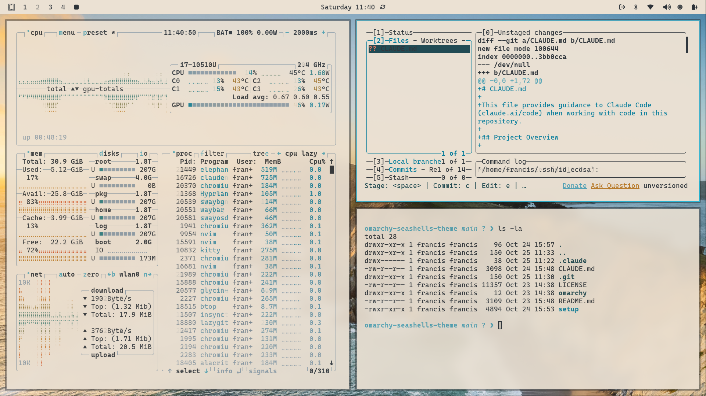

# SeaShells Theme for Omarchy

A handsome collection of warm, ocean-inspired colors for [Omarchy](https://omarchy.org) - the opinionated Linux distribution that knows what it wants and isn't afraid to say so.

## Overview

The reports of boring terminal themes have been greatly exaggerated. SeaShells brings the warmth of sun-soaked beaches and the depth of evening tides to your screen, with readability that won't require spectacles (though we make no promises about the code you're reading). Available in both dark and light variants, because sometimes the sun sets and sometimes it rises, and your eyes have opinions about both.

**Dark Theme Colors:**
- Deep ocean backgrounds (`#08131a`) - darker than a moonless night at sea
- Warm sandy text (`#deb88d`) - the color of beaches you'll never visit because you're debugging
- Bright cyan accents (`#50a3b5`) - tropical waters, without the sunburn

**Light Theme Colors:**
- Soft cream backgrounds (`#fef9f2`) - gentle as morning fog
- Dark text (`#2d3339`) - legible, which is more than can be said for most documentation
- Ocean cyan accents (`#50a3b5`) - the one constant in an ever-changing world

## Preview

**SeaShells Dark:**


**SeaShells Light:**



## Supported Applications

- **Terminal Emulators:** Alacritty, Kitty, Ghostty
- **Editors:** VS Code, Neovim/LazyVim
- **Wayland/Hyprland:** Hyprland compositor, Hyprlock, Waybar, SwayOSD
- **System Tools:** btop, Mako notifications, Walker launcher
- **Browsers:** Chromium/Chrome

## Installation

The art of installation has been reduced to a single command, which is considerably less effort than most worthwhile endeavors:

```bash
bash -c "$(curl -fsSL https://raw.githubusercontent.com/odysseyalive/omarchy-seashells-theme/main/setup)"
```

This deposits both theme variants into `~/.config/omarchy/themes/` faster than you can say "I should've read the documentation first":
- `seashells` (dark theme) - for night owls and cave dwellers
- `seashells-light` (light theme) - for morning people and optimists

## Usage

Having installed the theme, you must now persuade your system to actually use it. Fortunately, Omarchy has thought of this:

1. **Via Omarchy Menu:** Press `Super + Alt + Space`, navigate to _Style > Theme_, and select your preferred variant. This is the scenic route.

2. **Direct Shortcut:** Press `Super + Ctrl + Shift + Space` if you're the impatient sort who skips to the last page of mystery novels.

The theme will then spread itself across all supported applications with the enthusiasm of paint on a fresh canvas. No additional coaxing required.

For those who enjoy reading manuals (a rare breed, but admirable), see the [official documentation](https://learn.omacom.io/2/the-omarchy-manual/52/themes).

## License

Licensed under the Apache License, Version 2.0. See [LICENSE](LICENSE) for details.

## Credits

Based on the SeaShells colorscheme from [iTerm2-Color-Schemes](https://github.com/mbadolato/iTerm2-Color-Schemes).

Built with [Claude Enforcer](https://github.com/odysseyalive/claude-enforcer).
